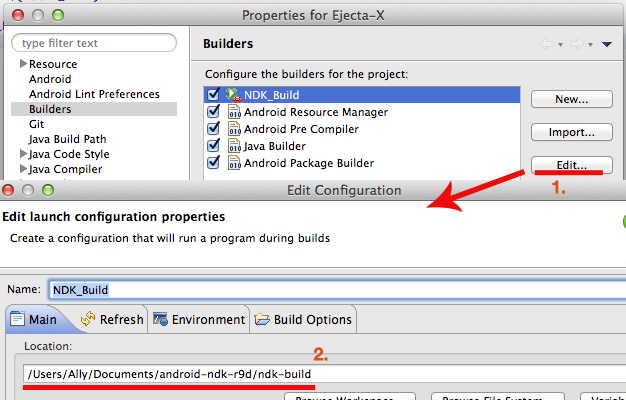

# Ejecta-X

Ejecta is a fast, open source JavaScript, Canvas & Audio implementation for cross-platform. Think of it as a Browser that can only display a Canvas element.

More info & Documentation: [http://impactjs.com/ejecta](http://impactjs.com/ejecta)

Ejecta is published under the [MIT Open Source License](http://opensource.org/licenses/mit-license.php).


## How to use

###Setup and Install for Android:

1. Install [Android NDK](http://developer.android.com/tools/sdk/ndk/index.html) first.
2. Install [Android SDK](http://developer.android.com/sdk/index.html) then Eclipse and ADT OR, [Android Studio](http://developer.android.com/sdk/installing/studio.html)
3. Building:
	- With NDK CLI: `cd project/android/jni/source` then run `/path/to/your/android-ndk-r9/ndk-build` to compile libejecta.so and libJavaScriptCore.so
	- With Eclipse: Open `project/android/` in Eclipse, change the NDK build phase [1] to point to your NDK path.
4. Build in your IDE or with ant.

 [1]

**Note for Windows users:-** 

Current branches no longer work on Windows after the OpenGLES update. Please use the older release [https://github.com/aogilvie/Ejecta-X/releases/tag/v0.9.9-original](https://github.com/aogilvie/Ejecta-X/releases/tag/v0.9.9-original)

### Sample

For an example application in the `sample` folder, name `Ejecta-X.apk`.

For XHR, remember to add ```<uses-permission android:name="android.permission.INTERNET"/>``` to the Android Manifest.

### Native Events

**Register for Java Events**

Set an event listener on your activity as follows;

	((EjectaGLSurfaceView)mGLView).setEjectaEventListener(new EjectaRenderer.EjectaEventListener() {
        @Override
        public void onCanvasCreated() {
            
    	}
	});
	
### Native APIs

**loadJavaScriptFile(String filename)**

Will load a JavaScript file into Ejecta-X. File should be relative from ```assets/build/<filename>```. 

For example to load a file at ```assets/build/loadme.js``` would be;
	
	((EjectaGLSurfaceView)mGLView).loadJavaScriptFile("loadme.js")

# Commit to Ejecta-X

## Workflow

Any kind of help is welcomed!

We work from `develop` branch and PR into `develop` branch. Stable versions are pushed from `develop` to `master` and then tagged.

## Where to start?

Just pick an enchancement (feature) issue or a bug issue from the [open issues list](https://github.com/Wizcorp/Ejecta-X/issues?state=open). Thanks for your help!

